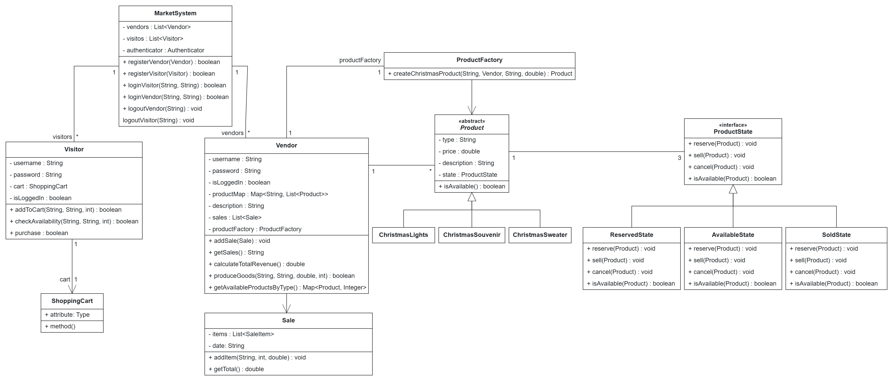

# online-Christmas-Market

## System description

This system represents a small online shopping platform where vendors and visitors interact with the system. Both parties must log in to perform certain tasks. The system employs the Factory and State design patterns to handle its functionality: the Factory pattern is used to produce goods from the vendor side, while the State pattern controls the state of each good, which can dynamically change (e.g., available, reserved, sold).

A RESTful architectural pattern was adopted to manage the interaction between the backend and frontend. The backend was implemented in Java, while the frontend relies on HTML, CSS, and JavaScript for the user interface. Furthermore, the application follows the Model-View-Controller (MVC) design pattern. The "Model" contains the core business logic and data structures (e.g., Marketsystem), the "Controller" (e.g., MarketController) handles REST endpoints, and the "View" comprises the frontend components.
## Features

1. Vendor Interface:
- Add products by specifying type, quantity, and description. 
- View sales statistics and total revenue.

2. Visitor Interface:
- Explore the market and browse vendors' products.
- Add products to the cart, view the cart, and complete purchases.

3. Guest Access:
- Browse the market without logging in.

## UML

## Usage instructions

1. Run the server part: MyApplication
2. Open view.html in a browser
3. That's it
